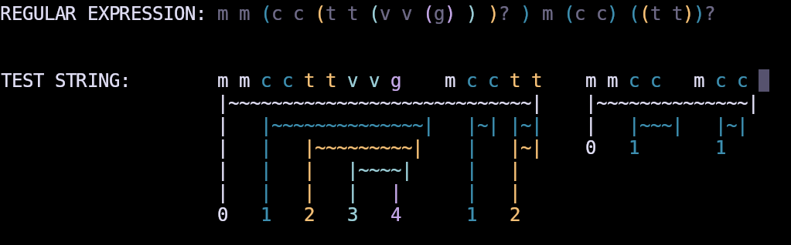

# REplay

> **Note**: This project is in early development phases.
>
> See [Project Status](#status).



_Screenshot showcasing current state of highlighting and capture group marking._

## Overview

This project attempts to bring [regex101](https://regex101.com/)'s functionality to the terminal.

## Setup

### Prerequisites

- `git`
- `cargo`

### Installation

Clone this repository:

```bash
git clone git@github.com:rotemhoresh/replay.git
```

Then build the project:

```bash
z replay  # or `cd`, if you don't use zoxide (which you should check out)
cargo build --release

# optional, move the binary somewhere
mv ./target/release/replay <path>

# optional, add the location to your path
export PATH="$PATH:<path>"
```

**Note for myself**:

- [ ] When the project is ready, add to:
  - [ ] crates.io
  - [ ] nixpkgs

## Usage

To run this tool, simply run the binary:

```bash
replay

# or, if not in your PATH
<path>/replay
```

You'll be presented with two text inputs, one for the regex and one for the test string:

```
REGULAR EXPRESSION: 


TEST STRING       :
```

You can switch between the inputs using:

- `Up`
- `Down`
- `Tab`
- `Ctrl + J`
- `Ctrl + K`
- `Ctrl + N`
- `Ctrl + P`

You can move inside the inputs using:

- `Right`: one character right
- `Left`: one character left
- `Ctrl + L`: one character right
- `Ctrl + H`: one character left
- `Ctrl + Right`: to the rightmost character
- `Ctrl + Left`: to the leftmost character

When the regex field contains a valid expression, the test string field will be colored according to matches and capture groups.

### Errors

If your regular expression is invalid, an error will be shown in the `TEST STRING` field:

```
REGULAR EXPRESSION: (


TEST STRING       : ERROR:
                    regex parse error:
                        (
                        ^
                    error: unclosed group
```

## Status

This project is currently a work in progress.

### Flavours

Currently, this project uses Rust's [regex](https://docs.rs/regex/latest/regex/) crate, and does not support any other regex flavour.

For now, it seems to me that more useful features are more important than supporting more regex flovours. This doesn't means that supporting more flavours is not planned, but it does mean that it is less of a priority ATM.

### Features

- [X] Basic regex parsing and test string mathches and captures groups highlighting in different color per group layel.
- [ ] Syntax highlighting for the regular expression.
- [ ] A widget that explain stuff and present insights on specific parts on demand.

More to come...

### Contributions

PRs, issues, suggestions and ideas are all appreciated and very welcome :)

## License

This project is licenced under [MIT](https://choosealicense.com/licenses/mit/).

